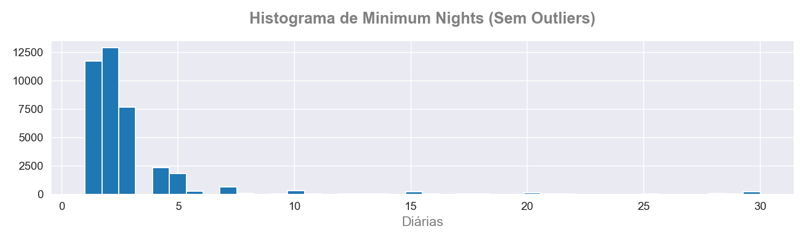
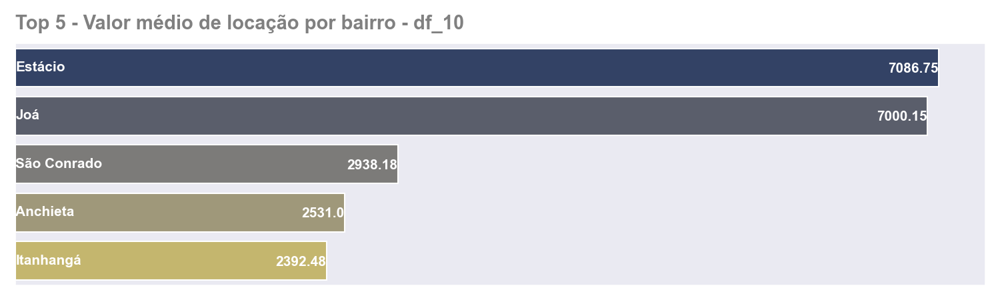
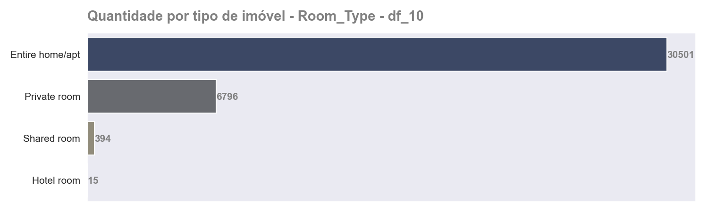
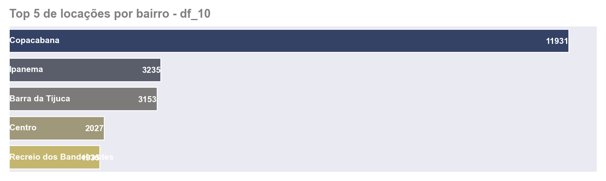

# 📊 Análise de Dados - Airbnb Rio de Janeiro

## 📌 Sobre o projeto
Este projeto tem como objetivo realizar uma análise exploratória dos dados do Airbnb no Rio de Janeiro, identificando padrões de preços, localização e comportamento dos anfitriões.

A análise foi conduzida utilizando Python e bibliotecas de manipulação e visualização de dados, com foco na extração de insights relevantes a partir de dados reais.

---

## 🛠️ Tecnologias utilizadas
- Python
- Pandas
- Matplotlib
- Seaborn
- Jupyter Notebook

---

## 📊 Principais Insights Visuais

### 💰 Distribuição de preços (sem outliers)
A maior parte dos imóveis está concentrada em faixas de preço mais baixas, com poucos valores extremamente altos distorcendo a distribuição original.



---

### 🏙️ Média de preços por bairro
Bairros turísticos e de maior valorização apresentam médias de preço significativamente mais elevadas, evidenciando o impacto da localização.



---

### 🏠 Tipo de acomodação
A maior parte dos anúncios é composta por imóveis inteiros, indicando uma preferência por maior privacidade por parte dos hóspedes.



---

### 📍 Top 5 bairros com mais anúncios
A concentração de imóveis está fortemente localizada em regiões turísticas, reforçando padrões de demanda e oferta.



---

## 🧠 Principais conclusões
- A localização é o principal fator de influência nos preços
- Existe alta concentração de imóveis em regiões turísticas
- Imóveis inteiros dominam a plataforma
- A presença de outliers pode distorcer análises, exigindo tratamento prévio dos dados

---

## 🚀 Como executar o projeto

```bash
pip install -r requirements.txt
jupyter notebook
